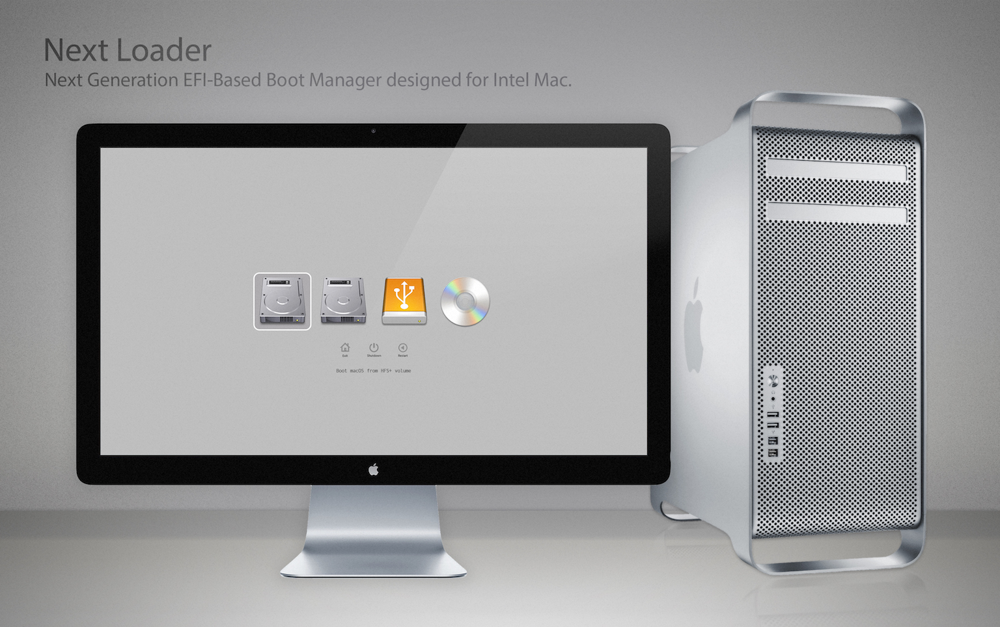

# Next Loader

> This project has been abandoned. Use OpenCore instead.

**Next Loader** – Next Loader is a next generation EFI-Based Boot Manager based on rEFInd tailored
and designed for Intel Macs in mind, meaning that it presents a menu of options to the user when
the computer first starts up, as shown in the image above.

Next Loader as well as rEFInd allow you to dynamically load EFI drivers, create boot stanzas with
custom arguments, and be highly customizable thanks to its built-in theme engine.

Next Loader was created to give Mac users more flexibility and options, allowing them to do dual-booting
or even triple-booting on their Mac without the need of hacks or tools.

## Features
### Built-in NVMe Driver
The NvmExpressDxe driver comes built-in and preloaded into Next Loader, allowing you to install any OS
and boot from NVMe on unsupported machines.

### UEFI GOP Compliant
Next Loader is compliant with the GOP standard of the UEFI implementation, allowing you to initialize 
any modern graphics card with GOP support, even working with HiDPi resolutions.

### Windows Without Boot Camp
Installs Windows (UEFI-Compatible only) without the need for Boot Camp or an optical drive (in the case
of Macs with optical drives), now you can install Windows in UEFI mode from a bootable USB drive.
You can install Windows in UEFI mode even on machines that do not support Boot Camp, such as Xserve.

### Multiple Booting Support
Mac do not support the installation of Linux or any other non-Windows operating system officially, the
only way was to use Boot Camp. Now you can not only install Windows, but also any Linux distribution and
have multiple booting options.

## Contributing to the Project
### Developers
Next Loader is a open source project, where all developers are welcome to contribute to the project by
solving problems or adding new features.

If you are a developer who wants to contribute, you can make a fork of the main repository, where you
can work an add your code and then open a pull request.

### Beta Testers
You can also contribute to the project as a Beta Tester, testing each new beta version or new features
of the project and sharing your feedback with us to improve the development.

### Donating to the Project
If you don't have enough time, the equipment or enough knowledge to contribute in any of the ways
mentioned above to the project, you can also donate hardware for our test bench build or donate any
amount through PayPal or Bitcoin.

##### Hardware we are looking for:
- Sapphire Pulse Radeon RX 580
- Nvidia GeForce GT 630 2GB (Flashed by MacVidCards)
- HP EX900 M.2 120GB PCIe 3.0 x4 NVMe SSD (or similar)

##### Donate any amount:
 - [PayPal](https://www.paypal.me/abdyfranco)
 - [Bitcoin](https://www.blockchain.com/btc/payment_request?address=1LMLf1JDouaeEwpUxsH6PpFptYM4LB7b9B) 

## Copyright
- Copyright (c) 2017-2018 [Abdy Franco](http://abdyfran.co/)
- Copyright (c) 2012-2017 [Roderick W. Smith](http://www.rodsbooks.com/)
- Copyright (c) 2009-2017 [Sveinbjorn Thordarson](http://sveinbjorn.org/)
- Copyright (c) 2004-2012 [Intel Corporation](https://www.intel.com)
- Copyright (c) 2006-2010 [Christoph Pfisterer](https://chrisp.de/en/)
